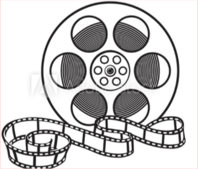

# Reel Movies

## Introduction

This project will enable the user to search for a movie title in the search bar and and render the movie details (Title, Plot, Actors, Awards and Ratings) along with the YouTube trailer to the screen. We used two API's to acheive this: OMDb API and the Google API (Youtube), information regarding implementation will be discussed later on in the README.md.

## User Story

GIVEN I am using a website to see movie summaries and trailers  
WHEN I load the webpage  
THEN I am presented with a header, a search bar and how to footer  
WHEN I navigate to the footer  
THEN I should see each of the developers names with links to their repositories and an email address to contact them with  
WHEN I input a movie name and click search  
THEN a movie details table appears containing the: Title, Plot, Actors, Awards and Ratings, appears below the search bar along with the YouTube trailer  
WHEN I search for a movie  
THEN I see a processing icon appear on the screen, that disappears when the promise has been completed  
WHEN I search for a movie that doesn't exist  
THEN I am presented with a modal alert informing me to rey again  
WHEN I search offline  
THEN I see an ERROR message rendered to the screen  
WHEN I resize the page or view the site on various screens and devices  
THEN I am presented with a responsive layout that adapts to my viewport  

## Design

We used Miro for a alot of brainstorming, specifically when it came to the design of the logic flow diagrams and the overall layout of the project.
The first stages of the design were to get an initial logic diagram drawn along with the layout. 

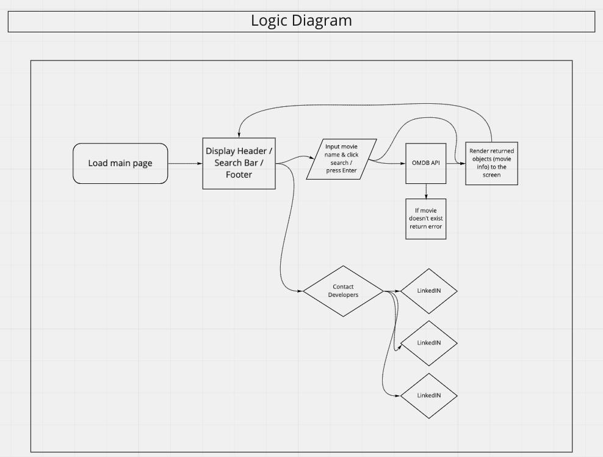
(Figure 1. Initial Logic Diagram)  

(Figure 2. Initial Design and Layout)  
 
 
As we progressed through the tasks it became apparent that we would need to update the design and add more granular details

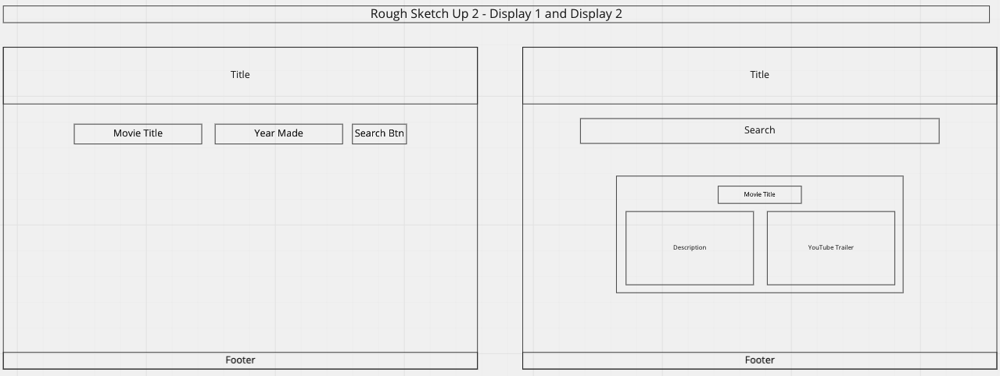
(Figure 3. Updated Design and Layout)
 
 

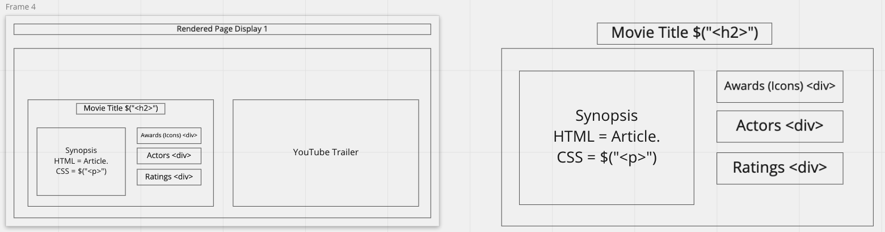
(Figure 4. Updated Summary Design and Layout)
 
 

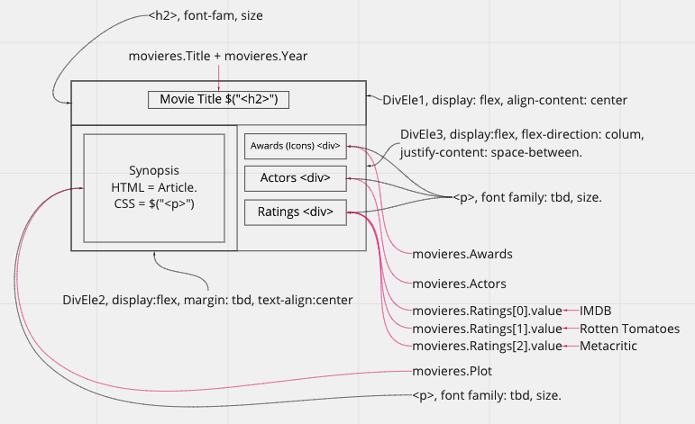
(Figure 5. Functional Summary Design)

Once we were happy with the design and all the functionality we designed, we created a final Logic Diagram
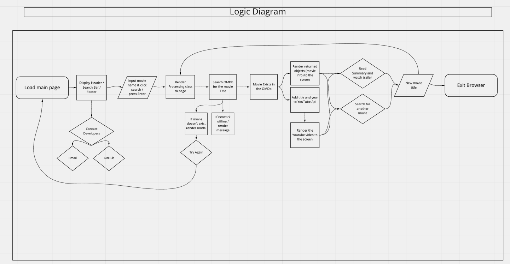
(Figure 6. Final Logic Diagram)

## APIs to be used

http://www.omdbapi.com/?apikey=[yourkey]&

https://www.googleapis.com/youtube/v3

## Final Product

Upon arrival, the user is greeted to the landing page.  
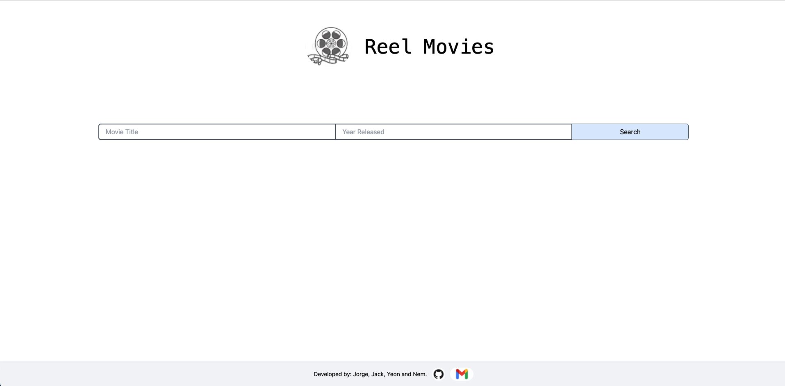
(Figure 7. Landing Page)
 
 

Searching for a movie without a year returns the closest match to the title in the OMDb.
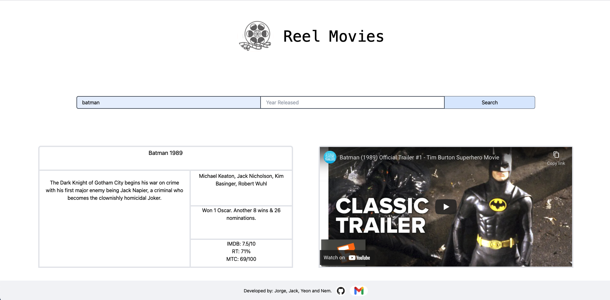
(Figuire 8. Searching for Batman without a year returns "Batman 1989")

Searching for a movie with a year returns a match in title and year from the OMDb.
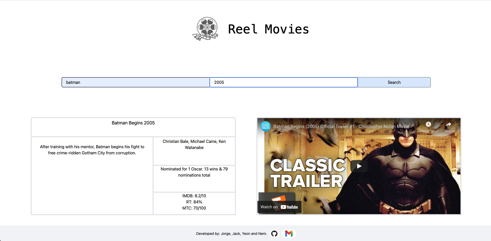
(Figuire 9. Searching for Batman without a year returns "Batman 1989")
 
 

Searching for another movie returns the same results.
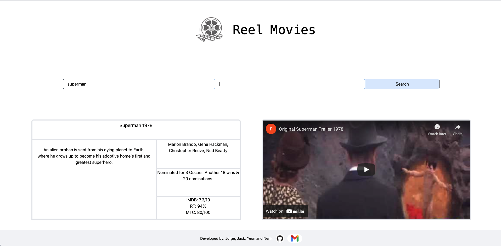
(Figure 10. Superman search)
 
 

If the movie in question did not exist a modal will appear prompting the user to try again
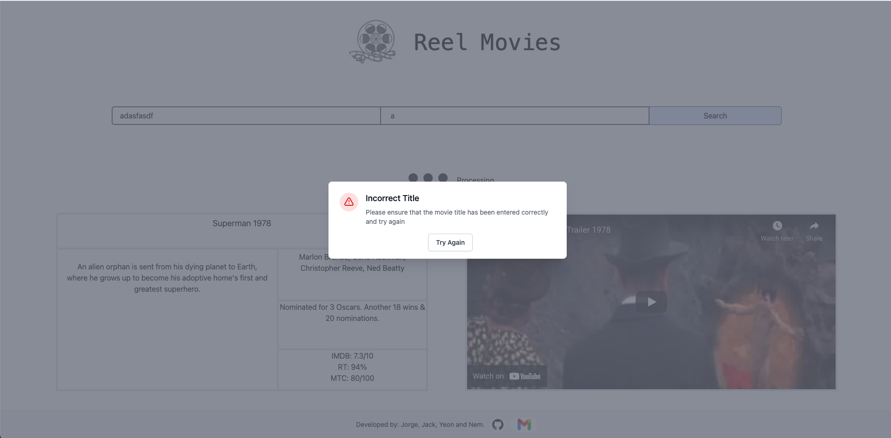
(Figure 11. Please try again)

The movie title was stored in local storage and rendered to the page one refresh.
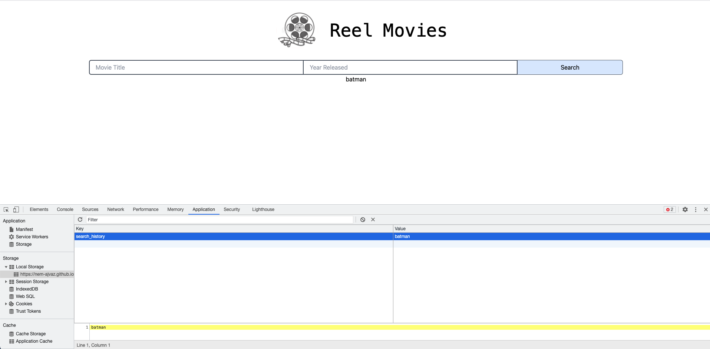

We thought it would be more realistic if we informed the user of what was happenning behind the screen, so
we implemented a processing element which appears once the search is initialised and is removed once the response is returned successfully. To do this we changed the network setting on chrome from "No Throttle" to "Slow 3G".
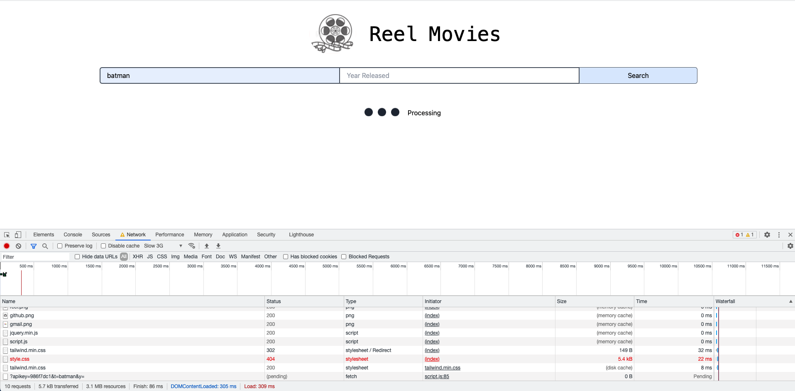
(Figure 12. Processing Element being displayed after a search)

Similarly we added a catch to the fetch function to notify the user if the response failed.
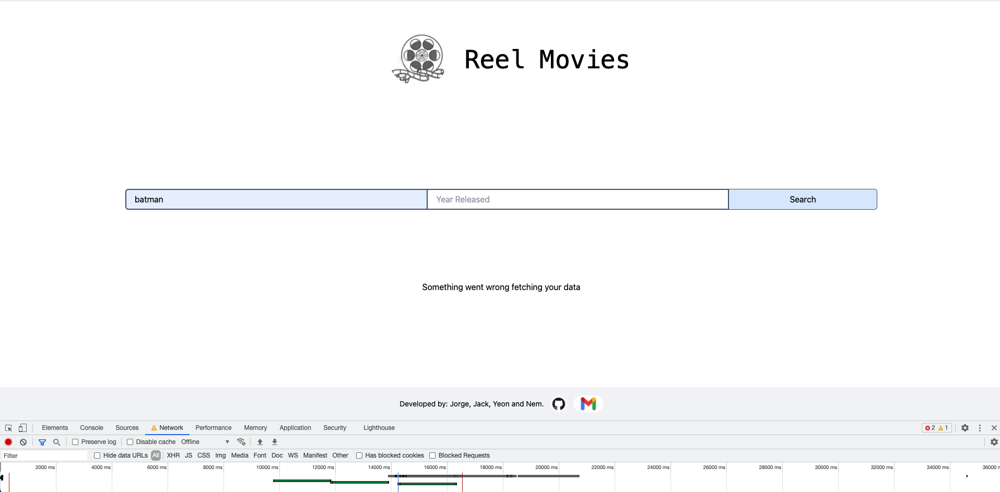
(Figure 13. User is alerted if something went wrong)

The design elements were responsive to screen size
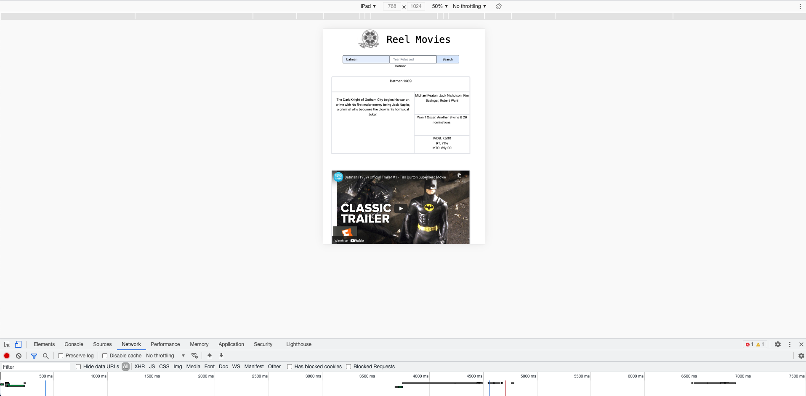
(Figure 14. Responsive Design)

## Future Development

Had we had more time, we would have liked to implement a feature that shows previous searches by clicking on three dots in the bottom-right of the header.
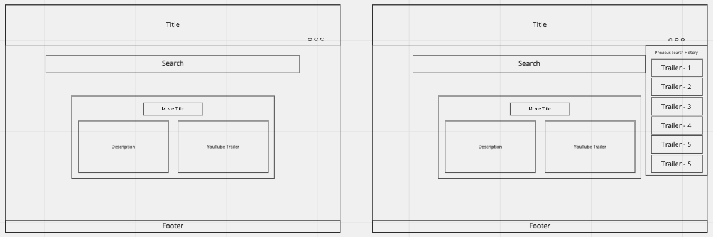
(figure 15. Future Design Layout)

## Challenges

Everyone contributed equally to this project, but we had severe issue with git branching and merging, and more often than not ended up sending each other zipped folders with the code. Hence the low number of commits to the project from some members. We are going to allocate some time for extra git practice so that this issue isn’t a factor in future projects. We also had team members with different strengths so we paired on a lot of work, therefore we didn’t need to commit twice for the same work.

## Lisence

MIT
